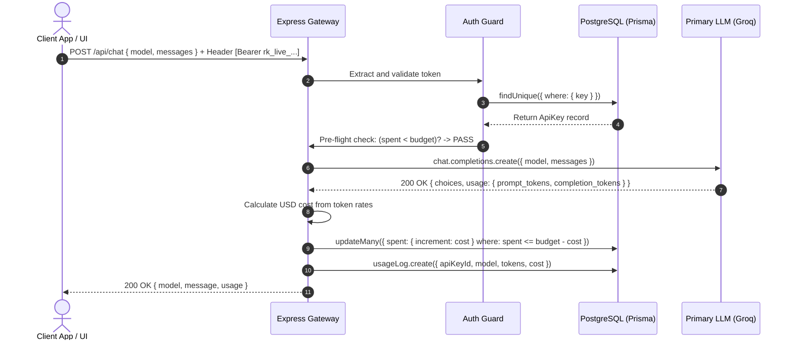
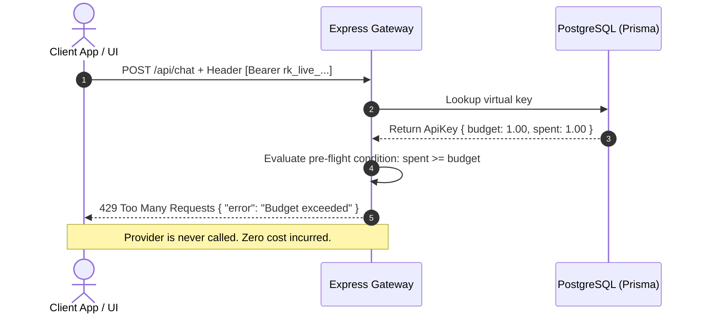
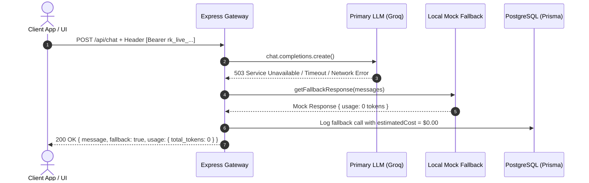

# System Architecture & Technical Design Document

## 1. Executive Summary

The **LLM Gateway** is a reverse proxy service engineered to sit between client applications and Large Language Model (LLM) inference providers (e.g., Groq, OpenAI). It solves three production challenges:
1. **Security & Key Isolation**: Master provider keys remain server-side; clients receive virtual API keys bounded by budget caps.
2. **Deterministic Spend Control**: Enforces hard budget limits per virtual key, returning immediate `429 Too Many Requests` when exhausted.
3. **Resilience & Fallback**: Automatically redirects traffic to a fallback provider when the primary upstream provider experiences downtime.

---

## 2. High-Level System Architecture

```
                                  ┌───────────────────────────────┐
                                  │   Frontend Developer Console  │
                                  │   (Vanilla JS / Static UI)    │
                                  └───────────────┬───────────────┘
                                                  │
                                                  │ HTTP (JSON / REST)
                                                  │ Authorization: Bearer rk_live_...
                                                  ▼
┌──────────────────────────────────────────────────────────────────────────────────────────────────┐
│                                       EXPRESS LLM GATEWAY                                        │
│                                                                                                  │
│   ┌──────────────────────────────┐                   ┌──────────────────────────────────────┐    │
│   │        Routing Layer         │                   │         Security Middleware          │    │
│   │   /api/chat   /api/keys      │ ────────────────► │       requireApiKey.js               │    │
│   │   /api/usage  /health        │                   │  (Bearer / x-api-key / ?key= query)  │    │
│   └──────────────────────────────┘                   └──────────────────┬───────────────────┘    │
│                                                                         │                        │
│                                                                         ▼                        │
│   ┌─────────────────────────────────────────────────────────────────────────────────────────┐    │
│   │                                   Service Layer                                         │    │
│   │                                                                                         │    │
│   │   ┌───────────────────────┐  ┌───────────────────────────────┐  ┌───────────────────┐   │    │
│   │   │     keyService.js     │  │        chatService.js         │  │  usageService.js  │   │    │
│   │   │  - Crypto generation  │  │  - Budget Pre-flight check    │  │  - DB Aggregation │   │    │
│   │   │  - Budget validation  │  │  - Primary LLM invocation     │  │  - Token metrics  │   │    │
│   │   └───────────────────────┘  │  - Fallback circuit breaker   │  └───────────────────┘   │    │
│   │                              │  - Cost formula calculator    │                          │    │
│   │                              │  - Atomic balance deduction   │                          │    │
│   │                              └───────────────┬───────────────┘                          │    │
│   └──────────────────────────────────────────────┼──────────────────────────────────────────┘    │
└──────────────────────────────────────────────────┼───────────────────────────────────────────────┘
                                                   │
                         ┌─────────────────────────┴─────────────────────────┐
                         │                                                   │
                         ▼                                                   ▼
       ┌───────────────────────────────────┐               ┌───────────────────────────────────┐
       │        PostgreSQL Database        │               │        LLM Provider Layer         │
       │   (Prisma ORM Client Singleton)   │               │                                   │
       │                                   │               │   ┌───────────────────────────┐   │
       │  • ApiKey (id, key, budget, spent)│               │   │ Primary: Groq SDK (Cloud) │   │
       │  • UsageLog (tokens, cost, ts)    │               │   └─────────────┬─────────────┘   │
       └───────────────────────────────────┘               │                 │ (on error)      │
                                                           │                 ▼                 │
                                                           │   ┌───────────────────────────┐   │
                                                           │   │ Fallback: Mock Generator  │   │
                                                           │   └───────────────────────────┘   │
                                                           └───────────────────────────────────┘
```

---

## 3. End-to-End Request Lifecycles

### Flow A: Successful Chat Completion Proxy



### Flow B: Budget Limit Exceeded Guard



### Flow C: Resilient Fallback on Upstream Provider Downtime



---

## 4. Concurrency Engineering & Race Condition Safety

When two concurrent HTTP requests arrive for a virtual key whose remaining balance is nearly zero:

1. **Pre-flight Check**: Both requests read the existing `spent` value and may pass the initial memory check if neither has completed yet.
2. **Conditional Atomic DB Update**:
   ```sql
   UPDATE "ApiKey"
   SET spent = spent + $cost
   WHERE id = $id AND spent <= (budget - $cost);
   ```
3. **Guarantee**: PostgreSQL guarantees row-level lock serialization during the `UPDATE`. Only the request that satisfies `spent <= budget - cost` increments `spent`. The database row will **never** exceed the configured budget.

---

## 5. Security & Isolation Model

- **Zero Credential Exposure**: `GROQ_API_KEY` is loaded strictly in server-side memory from `.env`.
- **Cryptographic Virtual Keys**: Keys are generated using Node.js `crypto.randomBytes(16).toString('hex')` prefixed with `rk_live_`.
- **Tenant Isolation**: Every `GET /api/usage` query enforces `where: { apiKeyId: req.apiKey.id }`. Keys have zero visibility into other keys' usage logs.

---

## 6. Directory Structure Overview

```
rentok/
├── frontend/             # Standalone / Unified Client Dashboard
│   ├── index.html        # UI structure
│   ├── css/style.css     # Styling
│   ├── js/app.js         # API integration logic
│   └── README.md         # Frontend docs
├── src/                  # Backend Application Core
│   ├── config/           # Environment configuration
│   ├── constants/        # Pricing & model constants
│   ├── controllers/      # HTTP route controllers
│   ├── services/         # Domain business logic & guards
│   ├── middleware/       # Auth guards & global error handlers
│   ├── lib/              # Prisma, Groq, cost, fallback singletons
│   ├── routes/           # Express routers
│   └── app.js            # Express application bootstrap
├── docs/                 # System Design & Architecture specs
│   └── ARCHITECTURE.md   # This document
├── prisma/               # Database models & migrations
├── tests/                # Unit & integration test suites
├── DECISIONS.md          # Architectural decisions & tradeoffs
├── AI-LOG.md             # Transparent AI collaboration record
├── README.md             # Repository documentation
├── Dockerfile            # Container configuration
└── docker-compose.yml    # Full-stack composition
```
